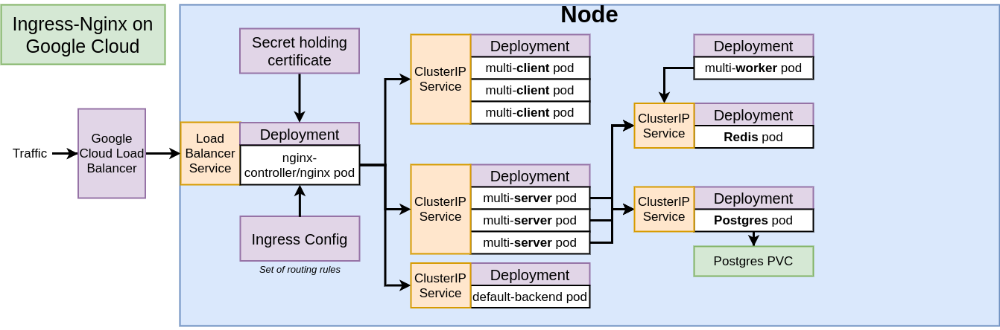

# Multi-k8s cluster

# 

_Credits to [Stephen Grider](https://www.udemy.com/course/docker-and-kubernetes-the-complete-guide/)_

### Introduction

This is an example of a production-grade system for managing complex applications with many different running containers. The CI+CD pipeline is built with Github and Travis CI. The application is deployed on Google Cloud Kubernetes cluster and set up with HTTPS.
